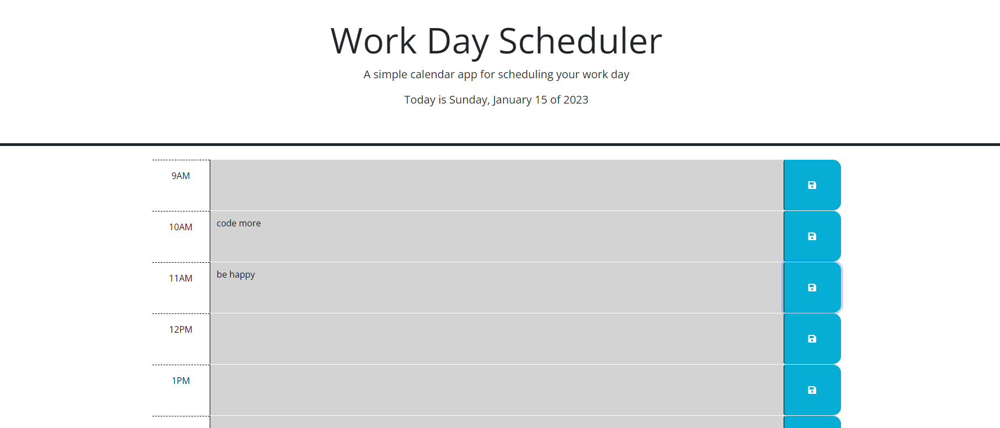

# <dailyEventPlanner>

## Description

I created this website to help plan my events each day.  Throughout the day, it can help stay organized and plan ahead to make sure everything that needs done for the day is accomplished.

By creating this website I learned many things about jQuery DOM traversal, using variables to create HTML elements, and utilizing API's to create a more dynamic website


## Installation

No installation required.  Planner will work simply by visiting the website.

## Usage

The default hours displayed are set to 9AM through 5PM.  If you wish to add additional hours, everything builds off a single array and you can edit it by following the notes in the script.js file.

For each hour, click within the empty text box, type your "to-do" for the hour, and click the image of a lock/save button on the right.  This will store whatever you have typed to local storage, so even if you leave the website or reload it, the text you typed will persist.  If you wish to remove the text, simply delete it and click the save button again.



    ```md

    

    ```

## Credits

Starter code provided by UMN bootcamp.

API added for jQuery, bootstrap, DayJS, FontAwesome, and GoogleAPIs:

https://code.jquery.com/jquery-3.4.1.min.js ;
https://cdn.jsdelivr.net/npm/bootstrap@5.1.3/dist/css/bootstrap.min.css ;
https://cdn.jsdelivr.net/npm/dayjs@1.11.3/dayjs.min.js ;
https://use.fontawesome.com/releases/v5.8.1/css/all.css ;
https://fonts.googleapis.com/css?family=Open+Sans&display=swap

## License

No additional licenses
